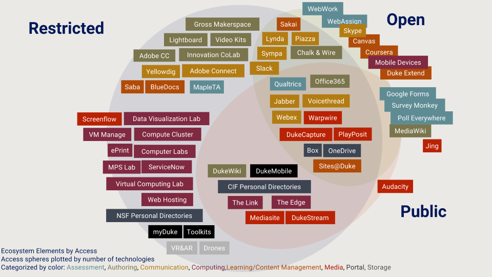

# EDUCAUSE ELI 18

This presentation was submitted with colleague Seth Anderson and we each spoke on a project related to [NGDLE](http://ngdle.org) concepts.

We were paired with a group of 4 other presenters and the 6 of us split our time evenly. [The session agenda can be found here](https://events.educause.edu/eli/annual-meeting/2018/agenda/presentation-pair-next-gen-digital-learning-environments). 

Below is the 4-minute lightning talk on [learn.duke](https://github.com/dukelearninginnovation/learn.duke).

---

I lead our learning technology services team which supports, operates, and strategizes various edtech at Duke. We partner for development. I focus on ecosystem-level strategy across all edtech services.

At Duke, our IT and academic culture is I’m sure similar to many of your institutions, one of technological plurality and choice, not a single, forced enterprise option.

For example, lecture and seminars make up 40% of courses at Duke, 70% of which create a Sakai site. Out of the remaining 60% of courses, like independent study or clinical, only 15% create Sakai sites. And of course, there is high variance across disciplines in each of those segments.

We’re embracing that pluralistic culture, and designing an interoperable learning community hub called learn.duke. Powered by open source technologies and standards, the primary project goals may sound familiar:

* Provide students a unified interface for accessing the tools used by their learning communities
* Provide faculty a catalog of learning technologies for use in their learning communities
* Allow faculty to manage the people in and tech of their learning communities.
* Provide information on learning technology management and policies.

The LMS solved a lot of these problems, but how might we accomplish these goals for all the courses, including those that don’t use the LMS?

The [learn.duke project](https://github.com/dukelearninginnovation/learn.duke) takes a [lean approach to user experience, design, and development](https://www.amazon.com/Lean-UX-Applying-Principles-Experience/dp/1449311652). 

Our [first minimum viable product](https://github.com/DukeLearningInnovation/learn.duke/milestone/1) acknowledges that because of that freedom to choose, our current learning technology ecosystem doesn’t adequately meet student’s need for a unified user interface to access all their learning communities.

Two questions drive our current MVP:

1. How might learn.duke accommodate the entire range of learning communities, those that use a single tool like the LMS or email, those using multiple supported tools, and those using their preferred, unsupported tools?
1. How might learn.duke encourage our learning communities to more frequently use the best tools to meet their learning goals while taking less energy to do so?

To answer those questions, we’re creating an app store to showcase available apps, with a suggestion box for what we tools we should integrate next. An "add custom tool" that’ll accept any URL and add it to your learning community.

In later development cycles, we’re adding templates of tool combinations known to be useful in particular modalities or disciplines and a wizard to help faculty decide what teaching techniques match their goals and what tools enable those techniques.

Another cycle adds a syllabus builder that ingests a Word doc, and abstracts out all the course components, recommend the best tools, meaningfully integrates them via open APIs or [IMS Global’s LTI Advantage](https://www.imsglobal.org/lti-advantage-overview), and displays the interactive syllabus to students. Increasing faculty adoption of tools while simultaneously saving them valuable time at the start of the semester.

We’ve decided that it’s worth building this framework outside the LMS, leveraging it for the structures and tasks which add value like orchestrating adaptive release across tools and being an authoritative gradebook. 

Leaving learn.duke as a standard launchpad for students, regardless of what technology choices their faculty, departments, disciplines, schools, or the university make.

We are managing the project [openly on GitHub](https://github.com/dukelearninginnovation/learn.duke) and sharing via the GPLv3. If you can click a pencil icon, you can contribute, and we welcome anyone interested in discussing, designing, or developing the project.

Thanks!
MG
